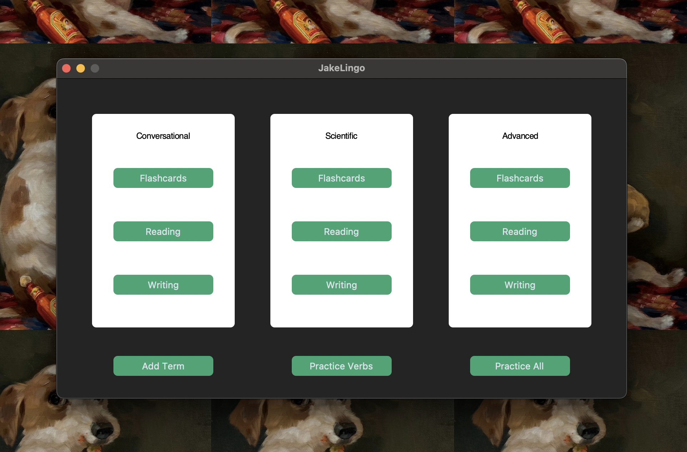

# JakeLingo: A Language Learning Alternative
Recently, I've seen many folks arguing the inefficacy of learning spanish through Duolingo, and with many other apps behind large paywalls, I decided to create an app geared towards the parts of the language-learning process I struggle with the most.

  

